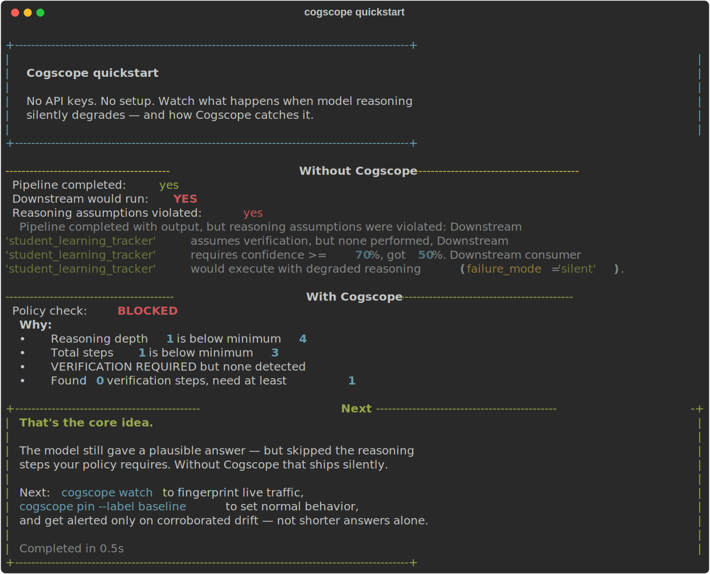

# Cogscope

**Your LLM can still look fine on output-only metrics while the reasoning underneath gets shallower.**

**Cogscope fingerprints how it reasons, compares that to behavior you pinned as normal, and catches silent regression locally — no API keys, no cloud.**

[](https://github.com/aadi-joshi/cogscope/actions)
[](pyproject.toml)
[](LICENSE)

---

## The problem

Model providers ship updates constantly. Latency stays flat, error rates stay low, and the final answer often still *looks* fine. What changes is the reasoning underneath: fewer verification steps, shallower chains of thought, more confident guesses.

Standard evals score the output text. They miss the silent regression where the answer is right today and wrong tomorrow because the model stopped checking its work. Cogscope watches **how** the model reasoned — depth, verification, hedging, corrections — and compares that fingerprint to behavior you have already pinned as normal.

### How this compares

| | Output-quality eval tools | Telemetry / observability tools | Cogscope |
|---|---------------------------|----------------------------------|----------|
| **What they measure** | Final answers, rubric scores, benchmark pass rates on fixed prompts | Latency, tokens, traces, spans, costs, error rates in production | Reasoning-shape metrics: depth, verification steps, hedging, corrections |
| **Baseline** | Global benchmarks or hand-written test sets | Fleet aggregates and dashboards | *Your* pinned fingerprint for *your* task and model |
| **What they miss** | Shallow reasoning when the answer still reads well | Whether reasoning behavior drifted from what you accepted before | Semantic understanding of "true" reasoning; cheat-proof attestation |
| **Typical use** | Pre-release regression suites | Production monitoring and debugging | Local proxy, CI policy checks, baseline-relative drift alerts |

These approaches are complementary. Cogscope targets the gap where output still passes but verification quietly disappeared.

---

## Demo

Real terminal output from `cogscope quickstart` (mock adapter, no API keys, recorded with Rich):



Run it yourself in under 30 seconds:

```bash
pip install -e .
cogscope quickstart
```

Regenerate the screenshot after UI changes: `python scripts/record_quickstart_demo.py`

---

## Install and try it

```bash
git clone https://github.com/aadi-joshi/cogscope.git
cd cogscope
pip install -e .
cogscope quickstart
```

`quickstart` runs a mock scenario: a pipeline that silently accepts shallow reasoning, then shows Cogscope blocking the same behavior against a policy. No configuration, no keys, under 30 seconds.

Initialize a project directory (creates `.cogscope/` and a local DuckDB store):

```bash
cogscope init --yes
```

---

## How it works

Point your app at the local proxy instead of the provider. Cogscope forwards traffic unchanged, fingerprints each completed response on the side (without delaying the stream), and compares new fingerprints to a baseline you pin.

```
  Your app          Cogscope proxy          Provider API
      │                    │                      │
      │  chat request      │  forward (same body) │
      ├───────────────────►├─────────────────────►
      │                    │                      │
      │  streamed response │◄─────────────────────┤
      ◄────────────────────┤                      │
      │                    │                      │
      │                    ├── capture trace       │
      │                    ├── fingerprint metrics │
      │                    ├── diff vs baseline   │
      │                    └── alert if outlier   │
```

| Step | What happens |
|------|----------------|
| **Capture** | Every proxied call becomes a `ReasoningTrace` (prompt, output, reasoning text, tokens). |
| **Fingerprint** | Heuristic metrics: reasoning depth, verification steps, hedging ratio, corrections, and more. |
| **Pin** | `cogscope pin --label baseline` saves “normal” for a task/model pair. |
| **Diff** | Live traffic is compared to that baseline; alerts fire only on **multi-metric** statistical outliers — not on shorter answers alone. |

### Day-to-day commands

```bash
# Local proxy + live terminal dashboard (default http://127.0.0.1:8642)
cogscope watch

# Pin the latest capture as your baseline
cogscope pin --label baseline

# One-shot diff of recent traffic vs baseline
cogscope diff --baseline baseline

# Policy check for CI (exit 0 pass, 1 blocked, 2 failed)
cogscope check -c examples/contracts/basic_reasoning.yaml "Your prompt here"

# Drift summary over the last 24 hours
cogscope report
```

Set `OPENAI_API_KEY`, `ANTHROPIC_API_KEY`, or `GOOGLE_API_KEY` in your environment before `watch`; keys stay in memory for forwarding only and are never written to the local database.

---

## What this is NOT

- **Not a universal intelligence score.** Metrics are relative to *your* pinned baseline for *your* task — not a leaderboard across models.
- **Not proof of provider wrongdoing.** Cogscope shows statistical deviation from behavior you recorded; it does not adjudicate intent or fault.
- **Not cheat-proof.** Someone optimizing specifically against these heuristics can game them. Treat alerts as signals to investigate, not verdicts.
- **Not alarmed by efficiency alone.** A model that becomes more concise **without** losing verification depth or other quality signals should **not** trigger a drift alert. Alerting requires corroborated, multi-metric outliers relative to your baseline distribution (see `cogscope/drift/detector.py`).

---

## Limitations (read this)

Fingerprint metrics are **heuristic and regex-based**, not semantic understanding. They count patterns like “let me verify”, step labels, and uncertainty markers — useful proxies, not ground truth. A model can appear deep while reasoning poorly, or concise while still being rigorous. Calibration improves with more baseline history, but this will never replace human review for high-stakes decisions.

---

## Local-first, no cloud

Cogscope runs entirely on your machine. No account, no telemetry, no bill. Traces and fingerprints live in a local DuckDB file under `.cogscope/`. The proxy binds to `127.0.0.1` by default. The only data that ever leaves your machine is what you explicitly choose to send via `cogscope submit` after a preview-and-confirm step.

---

## Development

```bash
pip install -e ".[dev]"
pytest
```

See [CONTRIBUTING.md](CONTRIBUTING.md) for setup, style, and how to add metrics or adapters.

---

## License

MIT — see [LICENSE](LICENSE).
